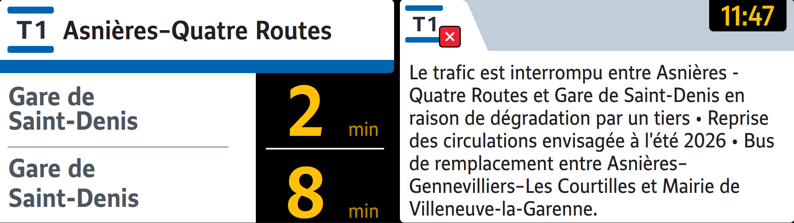
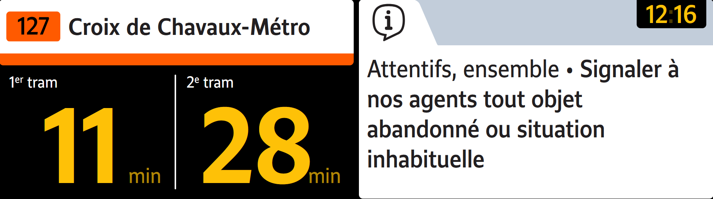
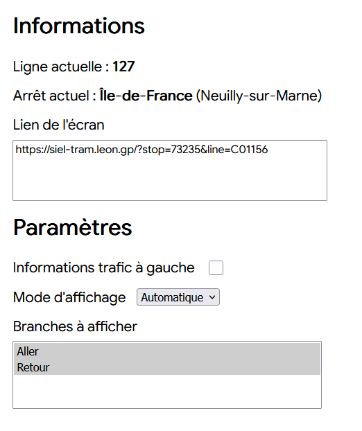
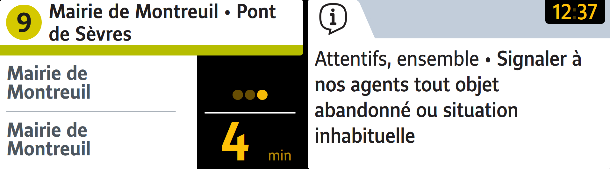
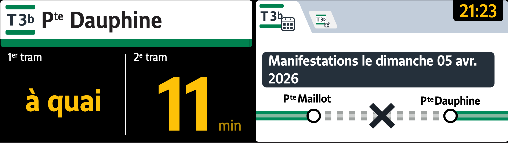
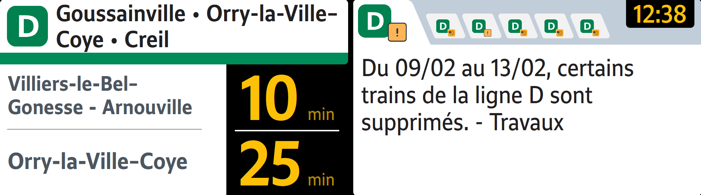
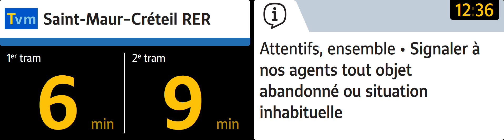
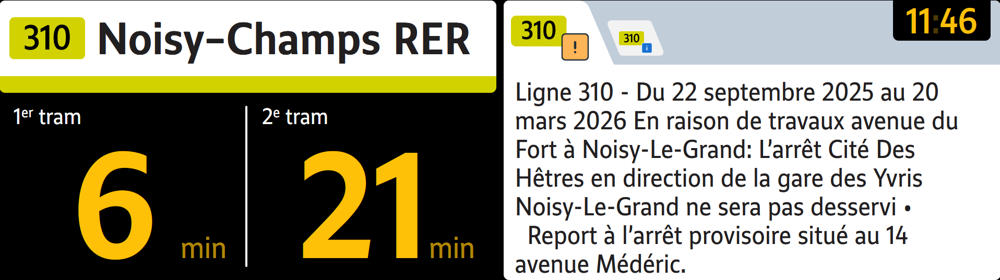
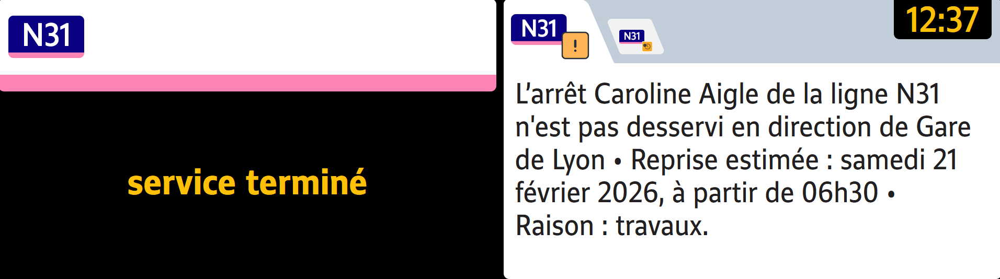

# Ecran SIEL - Tramway (type T1)
Dépot Git pour la reproduction de l'écran d'affichage des départs des tramways RATP 


## Démo de l'écran
L'écran est en ligne et disponible à la sélection sur les sites suivants :
- https://prochainstrains.arno.cl/
- https://departs.leon.gp/

Vous n'avez qu'à choisir un arrêt et une ligne. Tous les arrêts et lignes d'Île-de-France dont le temps réel est disponible via l'API IDFM sont supportés.

Des paramètres sont disponibles en scrollant vers le bas de la page


## Mise en place du projet
Récupérer le code du projet avec :
```sh
git clone git@github.com:Leon-ED/siel-tram.git
```
Se mettre dans le dossier
```sh
cd siel-tram/
```
Installer les dépendances

```sh
npm install
```
Lancer l'environnement de dev
```sh
npm run dev
```
Par défaut le projet sera disponible dans le navigateur avec l'url

> http://localhost:5173/

## Paramétrer l'affichage
Une fois les dépendances installées et le projet lancé, il faut récupérer 2 paramètres.

- `stop` : Identifiant de l'arrêt ([liste ici](https://data.iledefrance-mobilites.fr/explore/dataset/zones-de-correspondance/table/?disjunctive.zdctype)), récupérer le champ 'ZdCId'

- `line` : Identifiant de la ligne ([liste ici](https://data.iledefrance-mobilites.fr/explore/dataset/referentiel-des-lignes/table/?disjunctive.transportsubmode&disjunctive.operatorname&disjunctive.networkname&disjunctive.transportmode&disjunctive.id_bus_contrat)), récupérer le champ 'ID_Line'

Il est aussi possible de récupérer l'url depuis les sites : 
- https://prochainstrains.arno.cl/
- https://departs.leon.gp/

### Exemple
stop=73235 (arrêt Île-de-France à Neuilly-sur-Marne)
line=C01156 (bus 127)
URL locale: http://localhost:5173/?stop=73235&line=C01156
URL publique: https://siel-tram.leon.gp/?stop=73235&line=C01156

#### Rendu


### Options
En scrollant vers le bas plusieurs options sont disponibles :

- Informations trafic à gauche : Bascule le bloc d'information trafic à gauche de l'écran
- Mode d'affichage : 
-- Destinations : Affiche tout le temps les destinations et les temps d'attente
-- Horaires: Bloque l'affichage sur les temps d'attente sans afficher la destination
-- Auto: Bascule en mode destination si les prochains départs n'ont pas le même destination que le nom de la branche sinon reste en mode horaire
- Branches à afficher : Choisit quel sens afficher Aller/Retour. Selon les arrêts et la ligne seul Aller ou seul Retour peut afficher des résultats

> [!TIP]
> Les paramètres sont automatiquements enregistrés dans l'URL, vous pouvez donc copier l'URL et la partager tout en conservant la configuration de l'écran !




## Exemples







## Contribuer

Vous pouvez fork le projet pour proposer des pull requests.

Pour les PR, merci de :
- __Joindre des images__ réelles si les modifications concernent l'interface.
- Indiquer les modifications effectuées et dans quel but. 

## Sources des données
Certaines données utilisées dans ce projet proviennent d'Île-de-France Mobilités ([PRIM](https://prim.iledefrance-mobilites.fr/fr)).

Ces données sont soumises à leurs licences respectives (Licence Ouverte Etalab, ODbL, Licence Mobilité ou autre selon le type de données).

[© Île-de-France Mobilités](https://prim.iledefrance-mobilites.fr/fr/licences)

## Disclaimer
Ce projet est un projet indépendant et non officiel.

Il n’est en aucun cas affilié, associé, autorisé, soutenu ou approuvé par Île-de-France Mobilités, RATP, SNCF, ni par aucun autre opérateur de transport public.

Toutes les marques, noms commerciaux et logos mentionnés restent la propriété exclusive de leurs détenteurs respectifs.

Les données éventuellement utilisées proviennent de sources publiques ou ouvertes. Ce projet est développé à des fins informatives et communautaires uniquement.
## 
[Discord communautaire](https://discord.gg/ZkzaKMhTea)

[Hub des différents écrans](https://prochainstrains.arno.cl/)

[Wagon](https://getwagon.fr/)

